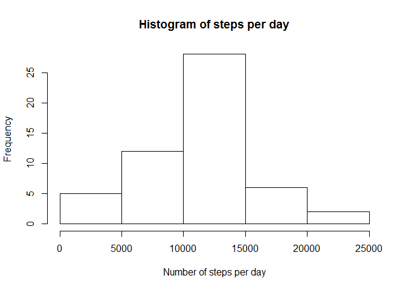
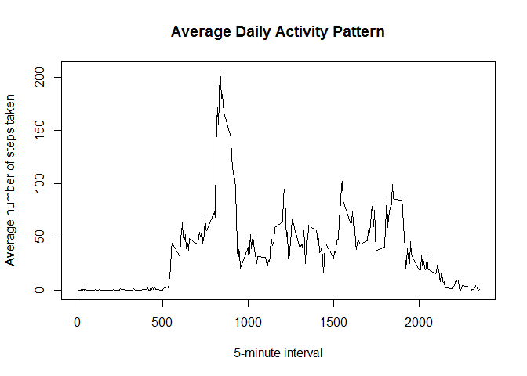
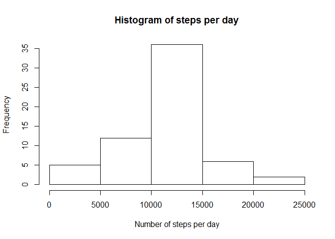
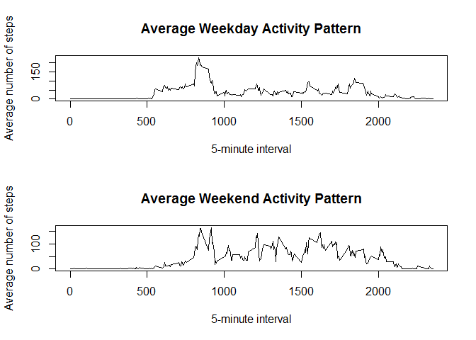

# Reproducible Research: Peer Assessment 1


## Loading and preprocessing the data

```r
if(!file.exists('activity.csv')){
    unzip('activity.zip')
}
activityData <-  read.csv("activity.csv", colClass=c('integer', 'Date', 'integer'))
```


## What is mean total number of steps taken per day?

### Histogram of the total number of steps taken each day

```r
NARactivityData <- na.omit(activityData) 
stepsPerDay <-  tapply(NARactivityData$steps, NARactivityData$date, sum ) 
hist(stepsPerDay, main = "Histogram of steps per day", xlab = "Number of steps per day")  
```

 

### Calculate and report mean and median of steps taken per day  

```r
stepsPerDayMean <-  as.integer(mean(stepsPerDay)) 
stepsPerDayMedian <- median(stepsPerDay)
```
Mean of steps taken per day: 10766

Median of steps taken per day: 10765


## What is the average daily activity pattern?

### Time series plot of the 5-minute interval and average number of steps, averaged across all days

```r
steps_Interval <- aggregate(steps ~ interval,  activityData, mean)
plot(steps_Interval, type='l', main = "Average Daily Activity Pattern", xlab ="5-minute interval", ylab = "Average number of steps taken") 
```

 

### The 5-minute interval containing the maximum number of steps

```r
maxSteps <-  which.max(steps_Interval$steps)
timeMaxSteps <- steps_Interval$interval[maxSteps]
```
Most steps at 835

 
## Inputing missing values

### The total number of missing values in the dataset 

```r
MissingVal <-sum(is.na(activityData$steps))
```
Number of missing values is data set is 2304

### Devise strategy to fill missing values
The strategy is to fill in missing values (NAs) for steps with the mean for that particular 5-min interval 

### Create new data set similar to the original dataset with the missing values filled in

```r
newActivityData <- activityData
newActivityData <- merge(activityData, steps_Interval, by="interval", suffixes=c("", "_mean"))
nas <- is.na(newActivityData$steps)
newActivityData$steps[nas] <- newActivityData$steps_mean[nas]
```
### Histogram of the total number of steps taken each day


```r
stepsPerDay <-  tapply(newActivityData$steps, newActivityData$date, sum ) 
hist(stepsPerDay, main = "Histogram of steps per day", xlab = "Number of steps per day")  
```

 


### Calculate and report mean and median of steps taken per day  

```r
stepsPerDayMean <- as.integer(mean(stepsPerDay))
stepsPerDayMedian <- as.integer(median(stepsPerDay))
```
Mean of steps taken per day: 10766

Median of steps taken per day: 10766

### Impact of filling the missing values
The values of mean and median are not significantly different from the first part of the assignment, but the total number of steps increases after filling in the missing values


## Are there differences in activity patterns between weekdays and weekends?

###  Create a new factor variable 
Create a new factor variable in the dataset with two levels - "weekday" and "weekend" indicating whether a given date is a weekday or weekend day.

```r
newActivityData$dateType <-  ifelse(as.POSIXlt(newActivityData$date)$wday %in% c(0,6), 'weekend', 'weekday')
```

### Make a panel plot containing  time series plots for weekdays and weekends


```r
par(mfrow=c(2,1))

WeekdayData <- subset(newActivityData, dateType=='weekday' )
steps_Interval <- aggregate(steps ~ interval,  WeekdayData, mean)
plot(steps_Interval, type='l',  main = "Average Weekday Activity Pattern", xlab ="5-minute interval", ylab = "Average number of steps")


WeekendData <- subset(newActivityData, dateType=='weekend' )
steps_Interval <- aggregate(steps ~ interval,  WeekendData, mean)
plot(steps_Interval, type='l', main = "Average Weekend Activity Pattern",  xlab ="5-minute interval", ylab = "Average number of steps")
```

 


